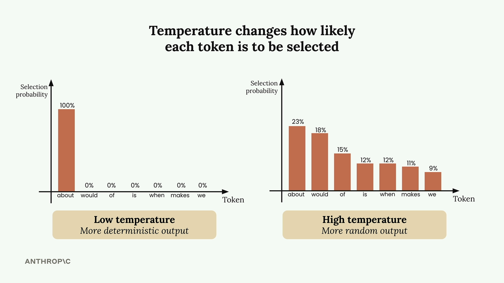
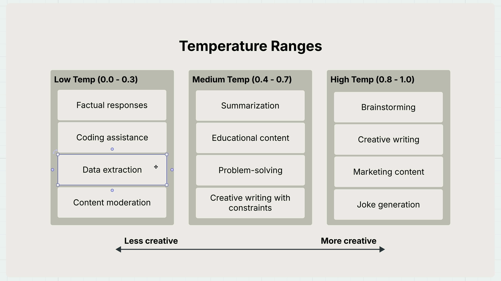

## How Claude Generates Text
Before diving into temperature, it helps to understand Claude's text generation process. When you send Claude a prompt like "What do you think?", it goes through three key steps:

- Tokenization - Breaking your input into smaller chunks
- Prediction - Calculating probabilities for possible next words
- Sampling - Choosing a token based on those probabilities

In this example, Claude might assign a 30% probability to "about", 20% to "would", 10% to "of", and so on. The model then selects one token and repeats this entire process to build complete sentences.

What Temperature Does
Temperature is a decimal value between 0 and 1 that directly influences these selection probabilities. It's like adjusting the "creativity dial" on Claude's responses.

At low temperatures (near 0), Claude becomes very deterministic - it almost always picks the highest probability token. At high temperatures (near 1), Claude distributes probability more evenly across options, leading to more varied and creative outputs.

## Choosing the Right Temperature
Different tasks call for different temperature ranges:

### Low Temperature (0.0 - 0.3)
- Factual responses
- Coding assistance
- Data extraction
- Content moderation
### Medium Temperature (0.4 - 0.7)
- Summarization
- Educational content
- Problem-solving
- Creative writing with constraints
### High Temperature (0.8 - 1.0)
- Brainstorming
- Creative writing
- Marketing content
- Joke generation

## Key Takeaways
Remember that temperature doesn't guarantee different outputs - it just changes the probability of getting them. Even at high temperatures, Claude might occasionally produce similar responses. The key is matching your temperature choice to your specific use case:
- Need consistent, factual responses? Use low temperature
- Want creative brainstorming? Dial up the temperature
- Somewhere in between? Medium temperatures work well for most general tasks

Temperature is one of the most practical parameters you can adjust to fine-tune Claude's behavior for your specific needs.
